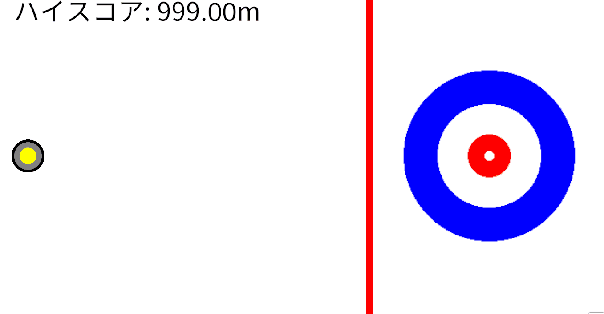
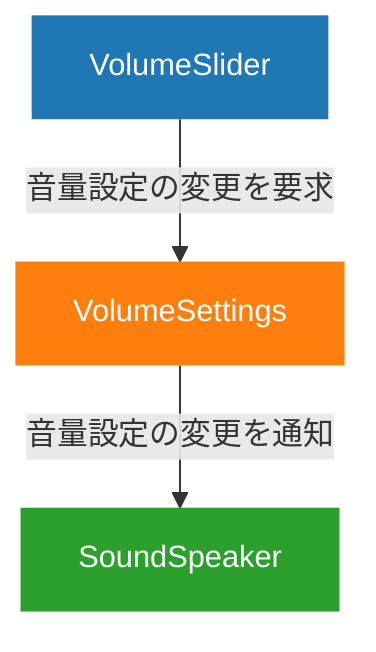

# カーリングストライカー



## 概要

カーリングを基にした、スコアアタック型アクションゲームです。
加速の回数とタイミングを調整し、カーリングストーンをどれだけハウスという円の中心に近づけられるかを競います。

## プレイ方法

### 始め方

ダウンロードは不要です。
以下のリンクからブラウザ上でプレイできます。

[**GitHub Pages で今すぐ遊ぶ！**](https://souyayamaguchi0803-dotcom.github.io/CurlingStriker/)

※現在も継続してアップデートやリファクタリングを行っているため、動作説明動画（v2.0.0で収録）と実際の最新バージョンのUI・挙動が一部異なる場合があります。

### 遊び方
- **対応デバイス**: PC、スマートフォン

#### PC
- **操作**: キーボード操作、マウス操作に対応
- **ルール**:
	1. `SPACE` キー、`ENTER` キー、画面クリックのいずれかでハウス方向に加速します。
	2. 時間経過でだんだん減速します。
	3. ボーダーラインを越えるまで、何度でも加速可能です。
	4. ボーダーラインを越えてストーンが停止したらゲーム終了。ハウスの中心との距離がスコアとなります。

#### スマートフォン
- **操作**: タップ操作
- **ルール**:
	1. 画面タップでハウス方向に加速します。
	2. 時間経過でだんだん減速します。
	3. ボーダーラインを越えるまで、何度でも加速可能です。
	4. ボーダーラインを越えてストーンが停止したらゲーム終了。ハウスの中心との距離がスコアとなります。
- **注意点**: プレイ時は、横画面モード推奨です。

---

ストーンの最終的な位置は、あなたがキーを押した回数とタイミングによって決まります。
上手くストーンの動きを見極め、より良いスコアを目指しましょう！

## 開発体制・期間
- **開発人数**: 1名（個人開発）
  - 企画、UI/UX設計、コーディング、リファクタリングまですべての工程を担当しました。
  - Insightsでは2人いるかのように表記されていますが、どちらも私です（途中からCo-authored-byを記載し始めたためと思われます）。
- **AI使用範囲**:
  - コードの草案作成や設計のレビュー、Unityの仕様調査などのサポートツールとして使用しました。
  - 提案されたコードをそのまま使用するのではなく、ネーミングの調整などを行い、動作についても十分理解したうえで実装に落とし込みました。
  - AIは、Google Gemini Proを使用しました。
- **開発期間**: 2025年9月 〜 2026年2月（学業と並行して開発）
- **開発所要時間**: 約90時間（概算）

<details>
<summary>所要時間の算出方法（クリックで展開）</summary>

正確なタイムトラッキングを行っていなかったため、各バージョンの開発時の状況に基づき以下のように推定しました。

- **v1.0.0（約36時間）**: 
  夏季休暇中の9月と大学後学期中の10月で分けて計算しました。
  当時は並行して行っていたソフトウェア工学の学習を重視していたこと、数日に分割して少しずつ作業を進めていたことを念頭に入れ、一日あたりの作業時間は少なめに算出しました。
  - 9月: 2時間 × 週4日 × 4週間 ＝ 32時間
  - 10月: 1時間 × 週2日 × 2週間 ＝ 4時間
- **v1.1.0 ～ v1.3.0（約33時間）**: 
  短期間であれば十分学業と並行して行える開発時間を一日の平均開発時間とし、下記のバージョン履歴をもとに作業日数を算出しました。
  - 平均3時間 × 11日 ＝ 33時間
- **v2.0.0（約18時間）**: 
  1つのプルリクエストあたり30分前後と仮定し、一日あたり平均8コミットを行ったため、平均作業時間は4時間としました。
  また、機能追加やリファクタリングの構想を考えるため、一日2時間かけたと仮定しました。
  - 平均作業時間4時間 × 3日 ＝ 12時間
  - 平均構想時間2時間 × 3日 ＝ 6時間

合計: 約87時間（約90時間として記載）
</details>

### バージョン履歴

| バージョン | 開発期間              | 主な変更点                                                                                                           |
| :--------- | :-------------------- | :------------------------------------------------------------------------------------------------------------------- |
| v1.0.0     | 2025年9月 ～ 10月中旬 | カーリングストーンの物理演算のシステム構築 <br> スコアの計算・保存システムの構築 <br> 中心となるゲームサイクルの実装 |
| v1.1.0     | 2026年1月2日 ～ 4日   | ゲーム内のテキストの変更                                                                                             |
| v1.1.1     | 2026年1月4日          | フォントの使用可能な文字の修正                                                                                       |
| v1.2.0     | 2026年1月17日 ～ 22日 | タイトルロゴの導入 <br> 画面のスケーラーの方式変更 <br> その他、リファクタリング等                                   |
| v1.2.1     | 2026年1月22日         | 圧縮形式の修正                                                                                                       |
| v1.3.0     | 2026年1月28日 ～ 29日 | BGM・SEの導入 <br> クレジットテキストの追加 <br> UIの調整 <br> その他、リファクタリング等                            |
| v2.0.0     | 2026年2月21日 ～ 23日 | 操作方法の追加 <br> 音量変更機能の追加 <br> リセット時の確認画面を追加 <br> UIの調整 <br> その他、リファクタリング等 |
| v2.0.1     | 2026年2月27日 ～ 28日 | スマホ横画面でのプレイにおけるUIの不具合を修正 <br> 一部コードのリファクタリング                                     |
| v2.0.2     | 2026年2月28日         | スマホ横画面でのプレイにおけるUIの不具合を修正                                                                       |

- **バージョン管理についての補足**:
  プロジェクトの初期段階ではローカル環境でのみ開発を行っておりました。
  その後、プロジェクトの拡大に伴い、バージョン管理の必要性を感じたため、2026年1月にGitHubの利用を開始しました。
  そのため、v1.0.0の開発期間とコミット履歴にはズレが生じております。

## 開発環境
- **エンジン**: Unity6.3(6000.3.9f1)
  - 2026/02/22 Unity6.2(6000.2.6f2)からアップデート
- **言語**: C#

## 使用素材
本ゲームの制作にあたり、以下のサイト様の素材を使用させていただきました。

### BGM
- **魔王魂** 様
    - https://maou.audio/

### SE (効果音)
- **効果音ラボ** 様
    - https://soundeffect-lab.info/

## コード設計
### 設計の方針
* **単一責任原則（SRP）と機能別パッケージング**
  一つのクラスが一つの役割に専念できるよう、クラスを細かく分割しました。
  また、スクリプトのフォルダ構成やシーンのヒエラルキーについても「画面別」ではなく「機能別（ドメイン別）」にまとめることで、目的のファイルを探す手間を極力減らす工夫をしています。
* **「目的のある」リファクタリングの徹底**
  目的のない過度な抽象化はオーバーエンジニアリングを招き、かえってコードを読みにくくするという考えのもと「現状の問題点は何か」「なぜその解決策（デザインパターンなど）が必要なのか」を明確に言語化できた場合にのみ、リファクタリングを実行しました。

### 特にこだわったポイント
#### スコアの値オブジェクトとしての実装
このプロジェクトでは、意図しない代入などのバグを防ぐ目的で、スコアを値オブジェクトの構造体 `Score` として実装しました。
具体的にこだわった点は、以下の通りです。
- **`readonly struct` による値オブジェクトの実現**
  ゲームにおけるスコアは値であり、不変性を持ち、等価比較が可能であることが望まれます。
  これに対し、`class` ではなく `readonly struct` と構造体で定義したことにより、値オブジェクトとしての性質を不要な複雑性を排除して実現しました。
- **目的に合わせたコンストラクタ**
  構造体 `Score` には、ストーンとハウスの距離からスコアを計算するコンストラクタと、スコアを `float` の引数として受け取り `Score` 型に変換するコンストラクタを用意しました。
  これにより、ゲームの結果からスコアを算出する前者と、保存されたハイスコアの復元を行う後者という形で、初期化方法の異なるスコアを、統一的に扱うことを可能にしました。
- **本質を追求したメソッドのネーミング**
  スコアの良し悪しの判定には、`IsBetterThan()` メソッドを用意しました。
  「値が大きい」「値が小さい」ではなく、「値が良い」というこのゲームにおける本質を追求した `Better` という語を使い、拡張性と可読性を両立いたしました。
  また、自然な英語として読めるメソッド名とすることにより、可読性の更なる向上を図りました。

<details>
<summary>実際の Score.cs のコード（クリックで展開）</summary>

*※補足: 以下のコードはv2.0.0 リリース時点の設計です。現在も継続してアーキテクチャの改善（リファクタリング）を行っているため、最新のリポジトリ内のソースコードとは一部実装が異なる場合があります。*

```csharp
using UnityEngine;

public readonly struct Score
{
	public readonly float Value;
	public const string unit = "m";
	public const float maxValue = 999f;

	// スコアを計算して初期化するコンストラクタ
	public Score(Vector2 stonePosition, Vector2 housePosition)
	{
		Value = Vector2.Distance(stonePosition, housePosition);
		if (Value > maxValue) Value = maxValue;
	}

	// スコア値を直接受け取って初期化するコンストラクタ
	public Score(float value)
	{
		this.Value = value;
	}

	// スコアの表示
	public string Show()
	{
		return $"{Value:F2}{unit}";
	}

	// より良いスコアならtrueを返す
	public bool IsBetterThan(Score other)
	{
		return Value < other.Value;
	}
}
```

</details>

#### 疎結合を重視した音量調節機能
音量調節機能においては、目的に応じて `SoundSpeaker`、`VolumeSettings`、`VolumeSlider` の3クラスに分割し、疎結合な実装となるよう心がけました。
具体的にこだわった点は、以下の通りです。
- **MVCパターンによる責任の分離**
  音量設定のデータを管理・保存する `VolumeSetting`、ユーザーに触れる部分を処理する `SoundSpeaker`、ユーザーの入力を処理する `VolumeSlider` という三つのクラスを作成しました。これにより変更の理由を分割し、独立した保守を可能にしました。
- **Observerパターンによる疎結合の実現**
  `VolumeSettings` は音量設定が変更された際にイベントを発行し、`SoundSpeaker` はそれを購読するようにしました。これにより、`VolumeSettings` はどのクラスが音量の変化の通知を必要としているかの情報を知る必要がなくなりました。
- **拡張性を保つクラスのネーミング**
  `VolumeSlider` は、MVCパターンのコントローラーに当たりますが、`VolumeController` という名前にはしませんでした。これは、将来音量調節をスライダー以外で行う機能修正・拡張が行われることになった際に、名前が衝突することなくクラスの新規作成が行えるようにすることを意図したためです。


